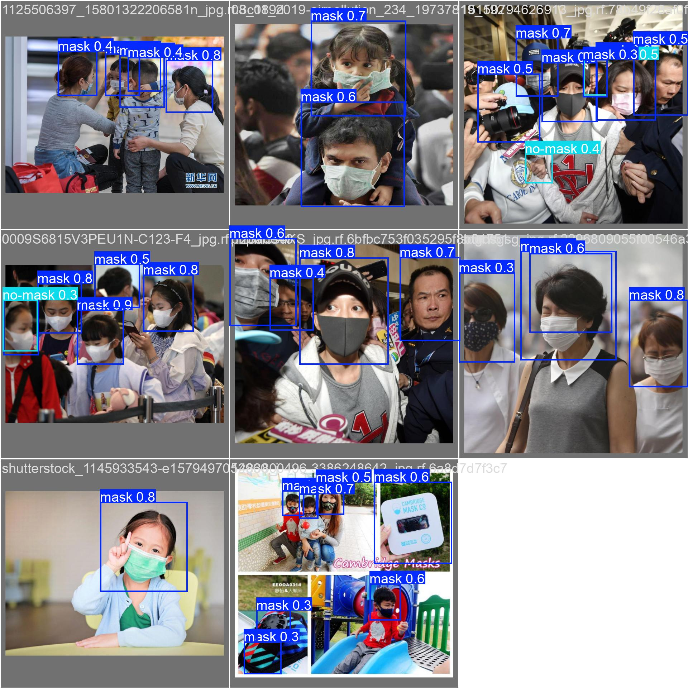

# Face Mask Detection System


## 🚀 Overview

A highly efficient deep learning solution for automated face mask detection in public spaces. This project uses the YOLOv11n architecture to provide real-time, accurate mask/no-mask classification with exceptional performance despite minimal training data.

<p align="center">
  
</p>

## 🔑 Key Features

- **Ultra-Fast Detection**: 2.3ms inference time per image
- **Lightweight Model**: Only 5.5MB with 2.58M parameters
- **High Accuracy**: 0.87 mAP50 overall, 0.924 mAP50 for mask detection
- **Efficient Training**: Completed 200 epochs in just 0.193 hours
- **Balanced Performance**: 0.811 precision and 0.811 recall
- **Multi-Environment Support**: Works across diverse settings and lighting conditions

## 📊 Performance

| Metric | Value |
|--------|-------|
| Model Size | 5.5MB (2.58M parameters) |
| Inference Speed | 2.3ms per image |
| mAP50 | 0.87 |
| Precision | 0.811 |
| Recall | 0.811 |
| Mask Detection | 0.924 mAP50 |
| No-Mask Detection | 0.817 mAP50 |
| GFLOPs | 6.3 |

## 🏗️ Technical Architecture

1. **Data Collection & Preprocessing**
   - Images resized to 640x640
   - Training on limited dataset (149 images)
   - Data augmentation to maximize learning

2. **Model Training & Optimization**
   - YOLOv11n architecture
   - 200 epochs using AdamW optimizer
   - Learning rate scheduling
   - Training completed in 0.193 hours

3. **Inference Engine**
   - 0.2ms preprocessing + 2.3ms inference + 1.2ms postprocessing
   - Real-time video frame processing

4. **Deployment & Integration**
   - Multiple export formats (YOLO, TensorFlow, COCO)
   - Compatible with existing surveillance systems
   - Easy deployment on edge devices

## 💻 Installation

```bash
# Clone the repository
git clone https://github.com/siddharth-bathrachalam/face-mask-detection.git
cd face-mask-detection

# Create and activate virtual environment
python -m venv venv
source venv/bin/activate   # On Windows: venv\Scripts\activate

# Install dependencies
pip install -r requirements.txt
```

## 🚂 Usage

### Object Detection

```python
# Import YOLO
from ultralytics import YOLO

# Load the model
model = YOLO('weights/best.pt')

# Perform detection and show results
model.show()

# For inference on an image
results = model('path/to/image.jpg')

# For real-time webcam detection
results = model(0, show=True)  # 0 for webcam
```

### Model Training

We use a Jupyter Notebook for training as provided by RNDsoft:

```python
# Open the training notebook
# Navigate to the RND training notebook and run the cells

# Example training command in the notebook
model = YOLO('yolov11n.yaml')
results = model.train(data='mask_dataset.yaml', epochs=200, imgsz=640)
```

## 🔄 Future Improvements

1. **Scalability**
   - Handle multiple surveillance feeds simultaneously
   - Distributed processing capabilities
   - Deployment across entire facilities

2. **Enhanced AI**
   - Expand training dataset beyond 149 images
   - Focus on challenging scenarios (partial visibility, unusual mask types)
   - Optimize to achieve >0.95 mAP50

3. **New Features**
   - Proper/improper mask wearing detection
   - Integration with access control systems
   - Anonymous occupancy tracking
   - Real-time analytics dashboard

## 🤝 Contributing

Contributions are welcome! Please feel free to submit a Pull Request.

1. Fork the repository
2. Create your feature branch (`git checkout -b feature/amazing-feature`)
3. Commit your changes (`git commit -m 'Add some amazing feature'`)
4. Push to the branch (`git push origin feature/amazing-feature`)
5. Open a Pull Request

## 📜 License

This project is licensed under the MIT License - see the [LICENSE](LICENSE) file for details.

## 👤 Author

- **Siddharth Bathrachalam** - [GitHub](https://github.com/siddharth-bathrachalam)

## 🙏 Acknowledgments

- Rathinam College of Arts and Science
- MSc. Data Science and Business Analysis Department
- RNDsoft for the problem statement
- Hackforge AI Hackathon organizers